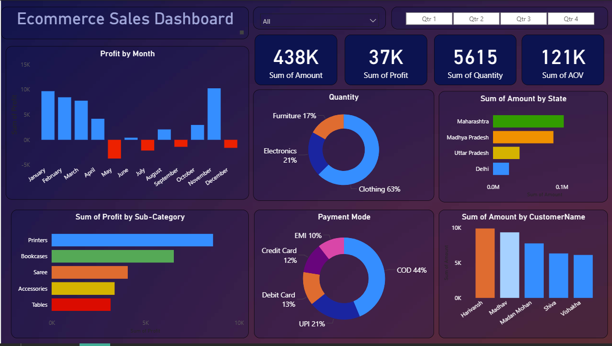

# 🧠 Power BI Project – Online Sales Data Dashboard

## 📊 Overview
This Power BI project focuses on building an **interactive dashboard** to track and analyze online sales data.  
It provides key insights into sales performance, trends, and user-driven analytics through dynamic filters and slicers.

---

## 🚀 Project Learnings

- Created **interactive dashboard** to track and analyze online sales data.  
- Used **complex parameters** to drill down in worksheets and customize dashboards using filters and slicers.  
- Created **connections**, joined new tables, and applied **calculations** to manipulate data and enable user-driven parameters for visualizations.  
- Used various types of customized **visualizations**, including:
  - Bar Chart  
  - Pie Chart  
  - Donut Chart  
  - Clustered Bar Chart  
  - Scatter Chart  
  - Line Chart  
  - Area Chart  
  - Map  
  - Slicers, etc.

---

## 🧰 Tools & Technologies Used
- **Power BI Desktop**
- **Power Query**
- **DAX (Data Analysis Expressions)**
- **Excel / CSV Data Source**
- **Power BI Service (optional for publishing)**

---

## 🖼️ Dashboard Preview

---

## 📁 Repository Structure
